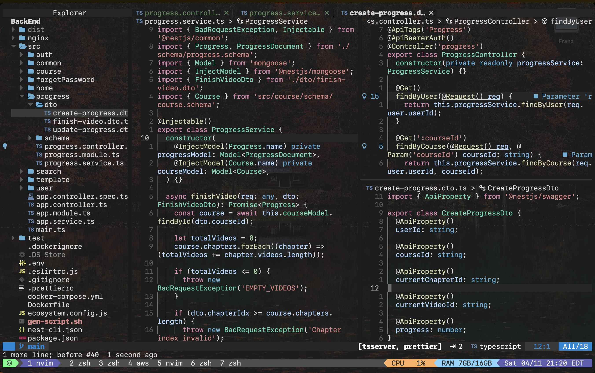
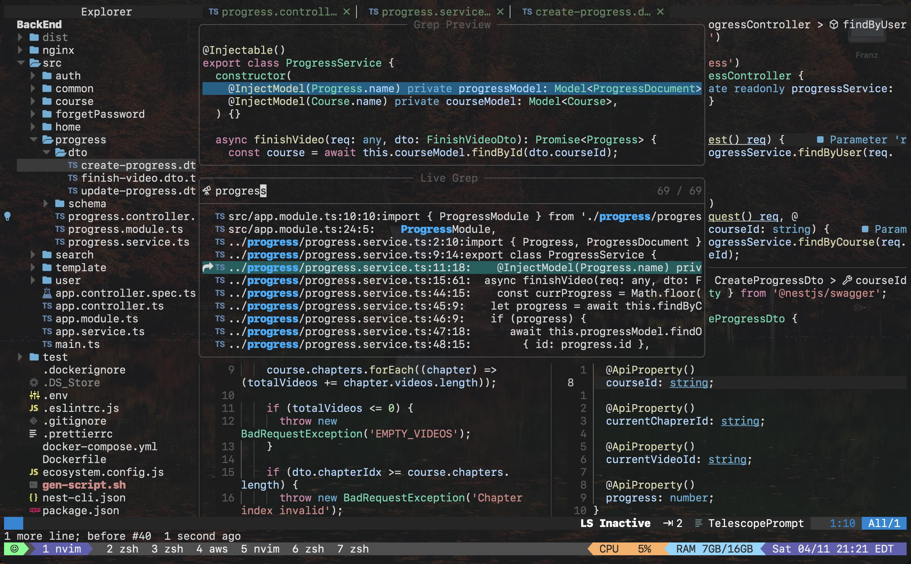
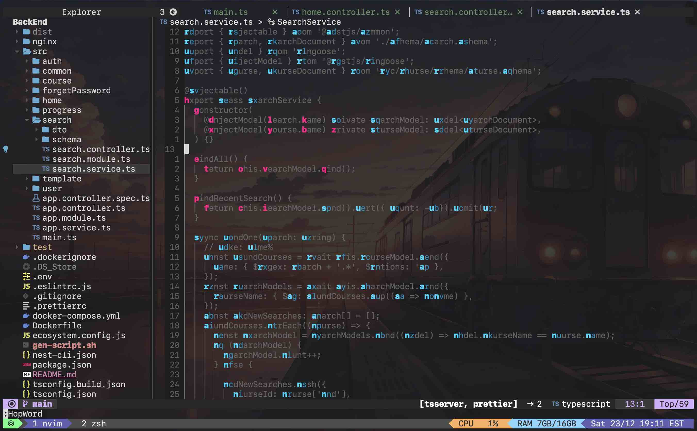

# Vim Developement Configurations

This repository contains my personalized configuration files for various tools and applications including Vim, Tmux, Yabai, and Alacritty. These configurations are tailored to optimize my workflow and enhance my development environment.

## Configuration Files

### Tmux Configuration

- **File**: `.tmux.conf`
- **Description**: Configuration for Tmux, including key bindings, plugins, and settings for session management.

### Yabai Configuration

- **File**: `.yabairc`
- **Description**: Configuration for Yabai, a window management utility for macOS. Contains settings for window layout, mouse behavior, padding, and application rules.

### Alacritty Configuration

- **File**: `alacritty.yml`
- **Description**: Configuration for Alacritty, a fast GPU-accelerated terminal emulator. Includes settings for window opacity, padding, font, and colors.

### Vim (LunarVim) Configuration

- **File**: `config.lua` (located in `.config/lvim`)
- **Description**: Configuration for LunarVim, a Neovim-based IDE, including key mappings, LSP settings, plugins, and customization options.

## LunarVim Installation

To install LunarVim, follow these steps:

1. Clone the LunarVim repository:
   ```bash
   git clone https://github.com/LunarVim/LunarVim.git ~/.config/lvim
   ```

2. Change to the LunarVim directory:
   ```bash
   cd ~/.config/lvim
   ```

3. Run the installation script:
   ```bash
   ./install.sh
   ```

4. After installation, copy the provided `config.lua` file into the `~/.config/lvim` directory to customize LunarVim according to your preferences.

## Showcase

<div align="center">
<br/>
<sup>Multi-spliting panes</sup>
</div>
 
<div align="center">
<br/>
<sup>Telescope</sup>
</div>

<div align="center">
<br/>
<sup>Hopword</sup>
</div>

## How to Use

1. **Tmux**: Copy the contents of `.tmux.conf` to your `~/.tmux.conf` file.
2. **Yabai**: Use the configurations from `.yabairc` by placing them in your Yabai configuration file.
3. **Alacritty**: Update your `alacritty.yml` file with the settings provided in the repository.
4. **Vim (LunarVim)**: Adjust `config.lua` based on your preferences and copy it to your LunarVim configuration directory.

## Usage Notes

- Make sure to backup your existing configuration files before replacing them with these settings.
- Refer to individual files for more specific information about each tool's configuration.

## Contributions

Feel free to suggest improvements or changes by creating a pull request. I'm open to enhancements that could further streamline or improve my development setup.

## Acknowledgments

Special thanks to the developers and contributors of the tools and plugins used in these configurations.
